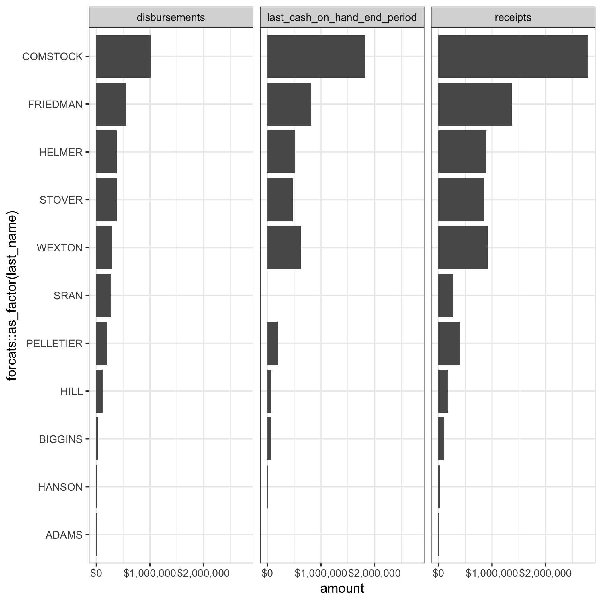
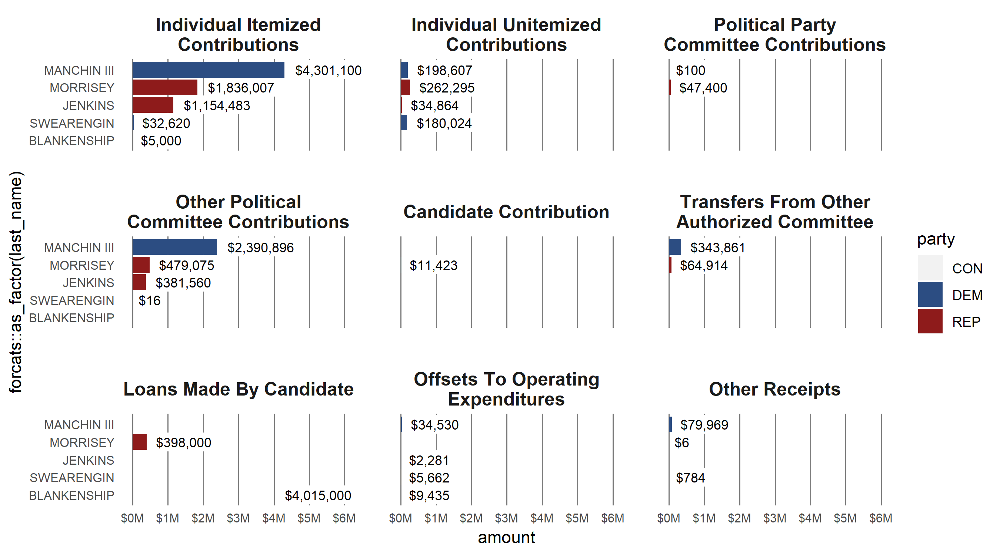

---
output:
  github_document:
    html_preview: false
---

```{r, echo = FALSE}
knitr::opts_chunk$set(
  collapse = TRUE,
  comment = "#>",
  fig.path = "README-"
)
options(tibble.print_min = 5, tibble.print_max = 5)
```

## tidyusafec

The tidyusafec package aims to make campaign finance data more accessible in R and friendly with tidy workflows. It works by accessing data through the [OpenFEC API](https://api.open.fec.gov/developers/), which requires an [API key](https://api.data.gov/signup/) to run.

[A gentle introduction is available here.](https://stephenholzman.github.io/tidyusafec/articles/intro.html)

## Installation

Though I'm developing out in the open, this is very much pre-alpha release status. Installation is through the devtools package

```{r, eval = FALSE}
install.packages("devtools")
devtools::install_github("stephenholzman/tidyusafec")
```

## Quick Examples

```{r, message = FALSE, warning = FALSE, eval = FALSE}
library(tidyverse)
library(tidyusafec)

#install api key
save_datagov_apikey("api-key-string")


df <- search_candidates(state = "VA", district = "05", office = "H", election_year = 2018, candidate_status = "C") %>%
  get_candidate_totals()

df %>% filter(type_of_funds %in% tidyusafec_filters$candidate_totals$type_of_funds$top_level, cycle == "2018") %>%
  separate(name, c('last_name', 'first_name'), sep = ', ', extra = "drop", fill = "right") %>%
  arrange(-desc(amount)) %>%
  ggplot() +
  geom_bar(aes(x = forcats::as_factor(last_name), y = amount), stat = "identity") +
  facet_wrap(~type_of_funds) +
  scale_y_continuous(labels = scales::dollar) +
  coord_flip() +
  theme_bw()

```

```{r, include = FALSE, eval = FALSE}
ggsave("README-example-top-level.png")
```
</img>

```{r, message = FALSE, warning = FALSE, eval = FALSE}
library(tidyverse)
library(tidyusafec)

wv_senate_search <- search_candidates(state = "WV", office = "S", election_year = "2018") %>%
  get_candidate_totals()

wv_senate_search %>% filter(type_of_funds %in% tidyusafec_filters$candidate_totals$type_of_funds$receipts_smallest_components, cycle == "2018", amount >= 0) %>%
  separate(name, c('last_name', 'first_name'), sep = ', ', extra = "drop", fill = "right") %>%
  mutate(type_of_funds = str_replace_all(type_of_funds,"_"," ") %>% str_to_title()) %>%
  arrange(-desc(amount)) %>%
  ggplot() +
  geom_bar(aes(x = forcats::as_factor(last_name), y = amount, fill = party), stat = "identity") +
  geom_label(aes(x = forcats::as_factor(last_name), y = amount, label = scales::dollar(amount)), hjust = -0.1, label.size = 0, label.padding = unit(0.2,"line"), size = 3) +
  facet_wrap(~factor(type_of_funds,levels = str_replace_all(tidyusafec_filters$candidate_totals$type_of_funds$receipts_smallest_components,"_"," ") %>% str_to_title), labeller = label_wrap_gen()) +
  scale_y_continuous(labels = paste0("$",seq(0,6),"M"), breaks = seq(0,6000000,by=1000000), limits = c(0,6000000)) +
  scale_fill_manual(values = c("DEM" = "#2c4d82", "REP" = "#8e1b1b", "IND" = "#a3a3a3", "GRE" = "#1c561d", "LIB" = "#afac3d", "CON" = "#AEAEAE")) +
  coord_flip(clip = "off") + 
  theme(
    panel.background = element_blank(),
    panel.grid.major.x = element_line(color = "#7c7c7c",size = .4),
    panel.grid.major.y = element_blank(),
    panel.spacing = unit(.8,"cm"),
    strip.text = element_text(size = 12, face = "bold"),
    strip.background = element_blank(),
    axis.ticks = element_blank(),
    plot.title = element_text(size = 26),
    plot.subtitle = element_text(size = 18),
    axis.text = element_text(size = 8)
  )

```

```{r, include = FALSE, eval = FALSE}
ggsave("README-example-receipts-type.png",width = 9, height = 5)
```
</img>
