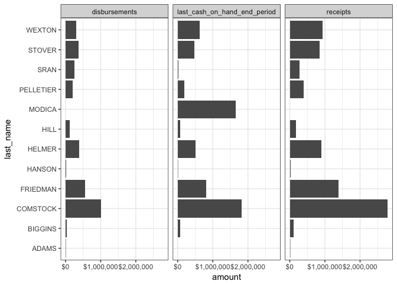

tidyfec
-------

The tidyfec package aims to make campaign finance data more accessible in R and friendly with tidy workflows. It works by accessing data through the [OpenFEC API](https://api.open.fec.gov/developers/), which requires an [API key](https://api.data.gov/signup/) to run.

Installation
------------

Though I'm developing out in the open, this is very much pre-alpha release status. Installation is through the devtools package

``` r
install.packages("devtools")
devtools::install_github("stephenholzman/tidyfec")
```

Examples
--------

``` r
library(tidyfec)
library(tidyverse)

#install api key
#data_gov_api_key("api-key-string")


df <- search_candidates(state = "VA", district = "10", office = "H", election_year = "2018") %>%
  get_candidate_totals()

df %>% filter(type_of_funds %in% tidyfec_filters$candidate_totals$type_of_funds$top_level, cycle == "2018") %>%
  separate(name, c('last_name', 'first_name'), sep = ', ', extra = "drop", fill = "right") %>%
  arrange(-desc(amount)) %>%
  ggplot() +
  geom_bar(aes(x = forcats::as_factor(last_name), y = amount), stat = "identity") +
  facet_wrap(~type_of_funds) +
  scale_y_continuous(labels = scales::dollar) +
  coord_flip() +
  theme_bw()
```


