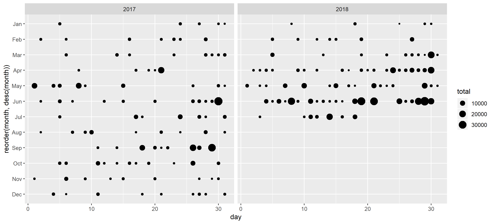

```{r setup, include=FALSE}
knitr::opts_chunk$set(
  collapse = TRUE,
  comment = "#>"
)
```

These functions covers itemized data. Want to who has been donating large amounts of money to candidates? Where they live? What about how committees are spending money? Who are the outside spenders?

As shown in these examples, the tidyusafec suggested workflow is to pipe (`%>%`) the results of a function with the `search_` prefix into a function with the `get_` prefix.

All itemized data is tied to a `committee_id`.

- `get_itemized_contributions` How much individual donors gave, when they gave, their names, where they're from, what they do for work. Alias: `get_schedule_a`.
- `get_itemized_distributions` How campaigns spent their money, who they paid, what for, and when. Alias: `get_schedule_b`.
- `get_itemized_loans` Transactions involving loans made by candidates or others and details about the transactions. Alias: `get_schedule_c`.
- `get_itemized_debts` Debts owed. Alias: `get_schedule_d`.
- `get_independent_expenditures` Look at outside spending. What committees, their names, when they spent, what they bought, etc. Alias: `get_schedule_e`.
- `get_party_expenditures` Look at party expenditures on behalf of candidates. Alias: `get_schedule_f`.

## get_itemized_contributions()

### Itemized Contributions by Day

```{r, eval = FALSE}
candidates <- search_candidates(election_year = 2018, office = "H", state = "MI", district = "06")

itemized_contributions <- candidates %>%
  filter(str_detect(name, "UPTON")) %>%
  get_itemized_contributions()

itemized_contributions %>%
  filter(is_individual == TRUE,
         is.na(memo_code)) %>%
  group_by(contribution_receipt_date) %>%
  summarise(total = sum(contribution_receipt_amount)) %>%
  mutate(year = lubridate::year(contribution_receipt_date),
         month = lubridate::month(contribution_receipt_date, label = TRUE),
         day = lubridate::day(contribution_receipt_date)) %>%
  ggplot() +
  geom_point(aes(x = day, y = reorder(month, desc(month)), size = total)) +
  facet_wrap(~year)

```

```{r, eval = FALSE, include = FALSE}
ggsave(filename = "itemized-contributions-example.png", width = 11, height = 5)
```
</img>

## get_itemized_disbursements()

### Itemized Disbursements by Category

```{r, eval = FALSE}
candidates <- search_candidates(election_year = 2018, office = "H", state = "VA", district = "05")

itemized_disbursements <- candidates %>%
  filter(str_detect(name, "COCKBURN")) %>%
  get_itemized_disbursements()

itemized_disbursements %>%
  filter(is.na(memo_code)) %>%
  group_by(disbursement_purpose_category) %>%
  summarise(total = sum(disbursement_amount)) %>%
  ggplot() +
  geom_point(aes(y = disbursement_purpose_category, x = total))

```

```{r, eval = FALSE, include = FALSE}
ggsave(filename = "itemized-disbursements-example.png", width = 11, height = 5)
```
</img>
