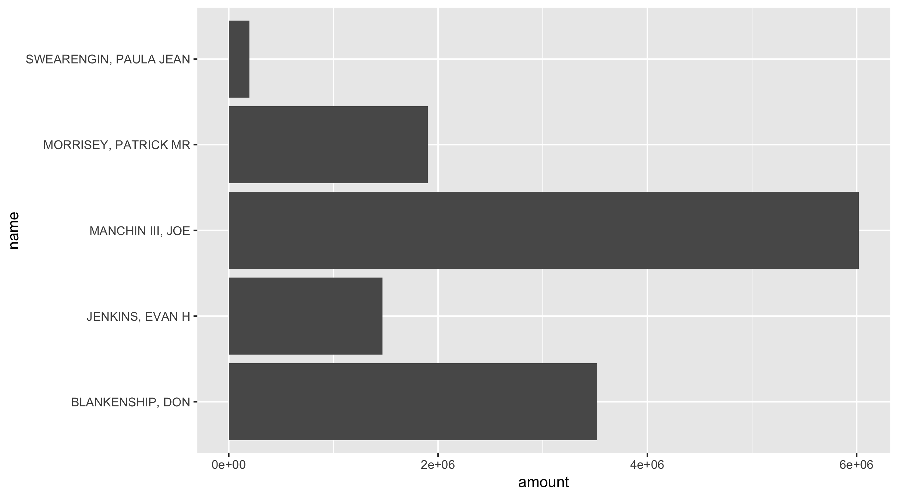

```{r setup, include=FALSE}
knitr::opts_chunk$set(
  collapse = TRUE,
  comment = "#>",
  fig.path = "README-"
)
```

tidyusafec is an [R package](https://www.r-project.org/) for accessing campaign finance data through the Federal Election Commission's [OpenFEC API](https://api.open.fec.gov/developers/). It depends on having R installed ([windows](https://cran.r-project.org/bin/windows/base/) | [mac](https://cran.r-project.org/bin/macosx/)), and suggests you also install the integrated development environment [RStudio](https://www.rstudio.com/products/rstudio/download/) if you are just beginning with R. tidyusafec is an independent open source project under MIT license maintained by [Stephen Holzman](github.com/stephenholzman). It is not affiliated with or endorsed by the FEC or any of the other software projects mentioned.

## 1. Installing

Depending on where R packages are hosted, you can install them from inside R with functions. Use `install.packages` to get the `devtools` package from CRAN. Use `install_github` to get `tidyusafec` from the [Github repository](https://github.com/stephenholzman/tidyusafec).

```{r, eval = FALSE}
install.packages("devtools")
devtools::install_github("stephenholzman/tidyusafec")
```

Load packages:

```{r, eval = FALSE}
library(tidyverse)
library(tidyusafec)
```


## 2. API Key

[To facilitate support and prevent abuse, the FEC requires registering for an API key to be sent with every request.](https://api.data.gov/signup/)

tidyusafec makes it easy to send requests to the FEC website's API for data. Some of the functions can realistically trigger thousands of requests spread out over several minutes. Check your email for an API key and substitute it for YOUR_API_KEY inside these quotes:

```{r, eval = FALSE}
save_datagov_apikey(key = "YOUR_API_KEY")
```

Running this saves the API Key on your machine so tidyusafec functions can use it automatically.

By default, the FEC limits individuals to 1000 requests every hour. This is probably enough for general use like:

 - 200 candidate-by-election searches leading to 800 requests for an individual candidate's financial totals per hour
 
 - 100,000 itemized contributions per hour.
 
 If you see yourself going over that limit, you can send APIinfo@fec.gov a request for their 120 calls per minute upgrade.

## 3. Start With a Search

`search_candidates` is the most common way to begin an analysis. An example search might look like:

```{r, eval = FALSE}
wv_senate <- search_candidates(state = "WV",
                                 election_year = "2018",
                                 office = "S")
```

```{r, eval = FALSE, include = FALSE}
select(wv_senate, -principal_committees, -.) %>%
  knitr::kable(format = "html") %>%
  kableExtra::kable_styling() %>%
  kableExtra::scroll_box(width = "100%", height = "200px")
```


<div style="border: 1px solid #ddd; padding: 5px; overflow-y: scroll; height:200px; overflow-x: scroll; width:100%; "><table class="table" style="margin-left: auto; margin-right: auto;">
 <thead>
  <tr>
   <th style="text-align:left;"> load_date </th>
   <th style="text-align:left;"> last_file_date </th>
   <th style="text-align:left;"> candidate_id </th>
   <th style="text-align:left;"> election_years </th>
   <th style="text-align:left;"> party </th>
   <th style="text-align:left;"> candidate_status </th>
   <th style="text-align:left;"> office_full </th>
   <th style="text-align:left;"> state </th>
   <th style="text-align:left;"> federal_funds_flag </th>
   <th style="text-align:left;"> has_raised_funds </th>
   <th style="text-align:left;"> office </th>
   <th style="text-align:left;"> election_districts </th>
   <th style="text-align:left;"> name </th>
   <th style="text-align:right;"> district_number </th>
   <th style="text-align:left;"> cycles </th>
   <th style="text-align:left;"> incumbent_challenge </th>
   <th style="text-align:left;"> party_full </th>
   <th style="text-align:left;"> first_file_date </th>
   <th style="text-align:right;"> active_through </th>
   <th style="text-align:left;"> incumbent_challenge_full </th>
   <th style="text-align:left;"> last_f2_date </th>
   <th style="text-align:left;"> district </th>
   <th style="text-align:left;"> committee_id </th>
   <th style="text-align:left;"> committee_name </th>
   <th style="text-align:left;"> treasurer_name </th>
   <th style="text-align:right;"> earliest_cycle </th>
   <th style="text-align:right;"> latest_cycle </th>
   <th style="text-align:right;"> earliest_election_year </th>
   <th style="text-align:right;"> latest_election_year </th>
  </tr>
 </thead>
<tbody>
  <tr>
   <td style="text-align:left;"> 2018-02-22T21:14:12 </td>
   <td style="text-align:left;"> 2017-12-01 </td>
   <td style="text-align:left;"> S8WV00150 </td>
   <td style="text-align:left;"> list(2018) </td>
   <td style="text-align:left;"> REP </td>
   <td style="text-align:left;"> C </td>
   <td style="text-align:left;"> Senate </td>
   <td style="text-align:left;"> WV </td>
   <td style="text-align:left;"> FALSE </td>
   <td style="text-align:left;"> TRUE </td>
   <td style="text-align:left;"> S </td>
   <td style="text-align:left;"> list("00") </td>
   <td style="text-align:left;"> BLANKENSHIP, DON </td>
   <td style="text-align:right;"> 0 </td>
   <td style="text-align:left;"> list(2018) </td>
   <td style="text-align:left;"> C </td>
   <td style="text-align:left;"> REPUBLICAN PARTY </td>
   <td style="text-align:left;"> 2017-12-01 </td>
   <td style="text-align:right;"> 2018 </td>
   <td style="text-align:left;"> Challenger </td>
   <td style="text-align:left;"> 2017-12-01 </td>
   <td style="text-align:left;"> 00 </td>
   <td style="text-align:left;"> C00662445 </td>
   <td style="text-align:left;"> DON BLANKENSHIP FOR U.S. SENATE </td>
   <td style="text-align:left;"> BLANKENSHIP, PAULA </td>
   <td style="text-align:right;"> 2018 </td>
   <td style="text-align:right;"> 2018 </td>
   <td style="text-align:right;"> 2018 </td>
   <td style="text-align:right;"> 2018 </td>
  </tr>
  <tr>
   <td style="text-align:left;"> 2018-02-17T09:16:20 </td>
   <td style="text-align:left;"> 2017-07-12 </td>
   <td style="text-align:left;"> S8WV00135 </td>
   <td style="text-align:left;"> list(2018) </td>
   <td style="text-align:left;"> REP </td>
   <td style="text-align:left;"> N </td>
   <td style="text-align:left;"> Senate </td>
   <td style="text-align:left;"> WV </td>
   <td style="text-align:left;"> FALSE </td>
   <td style="text-align:left;"> FALSE </td>
   <td style="text-align:left;"> S </td>
   <td style="text-align:left;"> list("00") </td>
   <td style="text-align:left;"> COPLEY, JIMMY DALE II </td>
   <td style="text-align:right;"> 0 </td>
   <td style="text-align:left;"> list(2018) </td>
   <td style="text-align:left;"> C </td>
   <td style="text-align:left;"> REPUBLICAN PARTY </td>
   <td style="text-align:left;"> 2017-07-12 </td>
   <td style="text-align:right;"> 2018 </td>
   <td style="text-align:left;"> Challenger </td>
   <td style="text-align:left;"> 2017-07-12 </td>
   <td style="text-align:left;"> 00 </td>
   <td style="text-align:left;"> NA </td>
   <td style="text-align:left;"> NA </td>
   <td style="text-align:left;"> NA </td>
   <td style="text-align:right;"> NA </td>
   <td style="text-align:right;"> NA </td>
   <td style="text-align:right;"> 2018 </td>
   <td style="text-align:right;"> 2018 </td>
  </tr>
  <tr>
   <td style="text-align:left;"> 2018-02-17T09:16:20 </td>
   <td style="text-align:left;"> 2017-05-09 </td>
   <td style="text-align:left;"> S8WV00127 </td>
   <td style="text-align:left;"> list(2018) </td>
   <td style="text-align:left;"> REP </td>
   <td style="text-align:left;"> C </td>
   <td style="text-align:left;"> Senate </td>
   <td style="text-align:left;"> WV </td>
   <td style="text-align:left;"> FALSE </td>
   <td style="text-align:left;"> TRUE </td>
   <td style="text-align:left;"> S </td>
   <td style="text-align:left;"> list("00") </td>
   <td style="text-align:left;"> JENKINS, EVAN H </td>
   <td style="text-align:right;"> 0 </td>
   <td style="text-align:left;"> list(2018) </td>
   <td style="text-align:left;"> C </td>
   <td style="text-align:left;"> REPUBLICAN PARTY </td>
   <td style="text-align:left;"> 2017-05-09 </td>
   <td style="text-align:right;"> 2018 </td>
   <td style="text-align:left;"> Challenger </td>
   <td style="text-align:left;"> 2017-05-09 </td>
   <td style="text-align:left;"> 00 </td>
   <td style="text-align:left;"> C00548271 </td>
   <td style="text-align:left;"> JENKINS FOR SENATE </td>
   <td style="text-align:left;"> KILGORE, PAUL A </td>
   <td style="text-align:right;"> 2014 </td>
   <td style="text-align:right;"> 2018 </td>
   <td style="text-align:right;"> 2018 </td>
   <td style="text-align:right;"> 2018 </td>
  </tr>
  <tr>
   <td style="text-align:left;"> 2018-04-20T21:11:18 </td>
   <td style="text-align:left;"> 2018-04-12 </td>
   <td style="text-align:left;"> S0WV00090 </td>
   <td style="text-align:left;"> list(2010, 2012, 2018) </td>
   <td style="text-align:left;"> DEM </td>
   <td style="text-align:left;"> C </td>
   <td style="text-align:left;"> Senate </td>
   <td style="text-align:left;"> WV </td>
   <td style="text-align:left;"> FALSE </td>
   <td style="text-align:left;"> TRUE </td>
   <td style="text-align:left;"> S </td>
   <td style="text-align:left;"> list("00", "00", "00") </td>
   <td style="text-align:left;"> MANCHIN III, JOE </td>
   <td style="text-align:right;"> 0 </td>
   <td style="text-align:left;"> list(2010, 2012, 2014, 2016, 2018) </td>
   <td style="text-align:left;"> I </td>
   <td style="text-align:left;"> DEMOCRATIC PARTY </td>
   <td style="text-align:left;"> 2010-07-22 </td>
   <td style="text-align:right;"> 2018 </td>
   <td style="text-align:left;"> Incumbent </td>
   <td style="text-align:left;"> 2018-04-12 </td>
   <td style="text-align:left;"> 00 </td>
   <td style="text-align:left;"> C00486563 </td>
   <td style="text-align:left;"> MANCHIN FOR WEST VIRGINIA </td>
   <td style="text-align:left;"> JACK ROSSI </td>
   <td style="text-align:right;"> 2010 </td>
   <td style="text-align:right;"> 2018 </td>
   <td style="text-align:right;"> 2010 </td>
   <td style="text-align:right;"> 2018 </td>
  </tr>
  <tr>
   <td style="text-align:left;"> 2018-04-24T21:15:20 </td>
   <td style="text-align:left;"> 2018-04-17 </td>
   <td style="text-align:left;"> S8WV00143 </td>
   <td style="text-align:left;"> list(2018) </td>
   <td style="text-align:left;"> REP </td>
   <td style="text-align:left;"> C </td>
   <td style="text-align:left;"> Senate </td>
   <td style="text-align:left;"> WV </td>
   <td style="text-align:left;"> FALSE </td>
   <td style="text-align:left;"> TRUE </td>
   <td style="text-align:left;"> S </td>
   <td style="text-align:left;"> list("00") </td>
   <td style="text-align:left;"> MORRISEY, PATRICK MR </td>
   <td style="text-align:right;"> 0 </td>
   <td style="text-align:left;"> list(2018) </td>
   <td style="text-align:left;"> C </td>
   <td style="text-align:left;"> REPUBLICAN PARTY </td>
   <td style="text-align:left;"> 2017-07-17 </td>
   <td style="text-align:right;"> 2018 </td>
   <td style="text-align:left;"> Challenger </td>
   <td style="text-align:left;"> 2018-04-17 </td>
   <td style="text-align:left;"> 00 </td>
   <td style="text-align:left;"> C00651075 </td>
   <td style="text-align:left;"> MORRISEY FOR SENATE INC </td>
   <td style="text-align:left;"> CRATE, BRADLEY MR </td>
   <td style="text-align:right;"> 2018 </td>
   <td style="text-align:right;"> 2018 </td>
   <td style="text-align:right;"> 2018 </td>
   <td style="text-align:right;"> 2018 </td>
  </tr>
  <tr>
   <td style="text-align:left;"> 2018-03-30T21:07:47 </td>
   <td style="text-align:left;"> NA </td>
   <td style="text-align:left;"> S8WV00168 </td>
   <td style="text-align:left;"> list(2018) </td>
   <td style="text-align:left;"> REP </td>
   <td style="text-align:left;"> N </td>
   <td style="text-align:left;"> Senate </td>
   <td style="text-align:left;"> WV </td>
   <td style="text-align:left;"> FALSE </td>
   <td style="text-align:left;"> FALSE </td>
   <td style="text-align:left;"> S </td>
   <td style="text-align:left;"> list("00") </td>
   <td style="text-align:left;"> NEWBROUGH, JACK </td>
   <td style="text-align:right;"> 0 </td>
   <td style="text-align:left;"> list(2018) </td>
   <td style="text-align:left;"> C </td>
   <td style="text-align:left;"> REPUBLICAN PARTY </td>
   <td style="text-align:left;"> NA </td>
   <td style="text-align:right;"> 2018 </td>
   <td style="text-align:left;"> Challenger </td>
   <td style="text-align:left;"> NA </td>
   <td style="text-align:left;"> 00 </td>
   <td style="text-align:left;"> NA </td>
   <td style="text-align:left;"> NA </td>
   <td style="text-align:left;"> NA </td>
   <td style="text-align:right;"> NA </td>
   <td style="text-align:right;"> NA </td>
   <td style="text-align:right;"> 2018 </td>
   <td style="text-align:right;"> 2018 </td>
  </tr>
  <tr>
   <td style="text-align:left;"> 2018-02-17T09:16:20 </td>
   <td style="text-align:left;"> 2018-02-03 </td>
   <td style="text-align:left;"> S8WV00119 </td>
   <td style="text-align:left;"> list(2018) </td>
   <td style="text-align:left;"> DEM </td>
   <td style="text-align:left;"> C </td>
   <td style="text-align:left;"> Senate </td>
   <td style="text-align:left;"> WV </td>
   <td style="text-align:left;"> FALSE </td>
   <td style="text-align:left;"> TRUE </td>
   <td style="text-align:left;"> S </td>
   <td style="text-align:left;"> list("00") </td>
   <td style="text-align:left;"> SWEARENGIN, PAULA JEAN </td>
   <td style="text-align:right;"> 0 </td>
   <td style="text-align:left;"> list(2018) </td>
   <td style="text-align:left;"> C </td>
   <td style="text-align:left;"> DEMOCRATIC PARTY </td>
   <td style="text-align:left;"> 2017-05-08 </td>
   <td style="text-align:right;"> 2018 </td>
   <td style="text-align:left;"> Challenger </td>
   <td style="text-align:left;"> 2018-02-03 </td>
   <td style="text-align:left;"> 00 </td>
   <td style="text-align:left;"> C00640219 </td>
   <td style="text-align:left;"> PAULA SWEARENGIN 2018 </td>
   <td style="text-align:left;"> TERI DALTON </td>
   <td style="text-align:right;"> 2018 </td>
   <td style="text-align:right;"> 2018 </td>
   <td style="text-align:right;"> 2018 </td>
   <td style="text-align:right;"> 2018 </td>
  </tr>
  <tr>
   <td style="text-align:left;"> 2018-03-30T21:07:47 </td>
   <td style="text-align:left;"> NA </td>
   <td style="text-align:left;"> S8WV00176 </td>
   <td style="text-align:left;"> list(2018) </td>
   <td style="text-align:left;"> REP </td>
   <td style="text-align:left;"> N </td>
   <td style="text-align:left;"> Senate </td>
   <td style="text-align:left;"> WV </td>
   <td style="text-align:left;"> FALSE </td>
   <td style="text-align:left;"> FALSE </td>
   <td style="text-align:left;"> S </td>
   <td style="text-align:left;"> list("00") </td>
   <td style="text-align:left;"> WILLIS, THOMAS (TOM) </td>
   <td style="text-align:right;"> 0 </td>
   <td style="text-align:left;"> list(2018) </td>
   <td style="text-align:left;"> C </td>
   <td style="text-align:left;"> REPUBLICAN PARTY </td>
   <td style="text-align:left;"> NA </td>
   <td style="text-align:right;"> 2018 </td>
   <td style="text-align:left;"> Challenger </td>
   <td style="text-align:left;"> NA </td>
   <td style="text-align:left;"> 00 </td>
   <td style="text-align:left;"> NA </td>
   <td style="text-align:left;"> NA </td>
   <td style="text-align:left;"> NA </td>
   <td style="text-align:right;"> NA </td>
   <td style="text-align:right;"> NA </td>
   <td style="text-align:right;"> 2018 </td>
   <td style="text-align:right;"> 2018 </td>
  </tr>
</tbody>
</table></div>


Each row returned by `search_candidates` contains a unique `candidate_id` + `committee_id` pair. Candidates just getting started or not raising money may have no committee_id, and some candidates may have multiple rows if they changed principal committees for different elections.

`candidate_status` is a notable column to filter on and be aware of. It goes by FEC status according to records filed and processed, not necessarily what candidates have announced about their intentions.

Some filter strategies are below, or you could use `search_candidates` better when you know exactly what you are looking for.

```{r, eval = FALSE}

#Candidates still actively campaigning based on public announcements.
wv_senate %>%
  filter(str_detect(name, "MANCHIN|MORRISEY|BLANKENSHIP"))

#Candidates who are still current as far as the FEC knows.
wv_senate %>%
  filter(candidate_status == "C")

#An alternative search if we know we only want current candidates from the start.
wv_senate <- search_candidates(state = "WV",
                                 election_year = "2018",
                                 office = "S",
                                 candidate_status = "C")

```

## 4. Get Financial Data

The results of `search_candidates` can be piped (using `%>%`) into one of the appropriate functions that begin with a `get_` prefix.

Start by getting financial totals for each candidate.

```{r, eval = FALSE}
wv_senate_totals <- wv_senate %>%
  get_candidate_totals()
```
```{r, eval = FALSE, include = FALSE}
select(wv_senate_totals[1:20,], -principal_committees,-..x,-..y) %>%
  knitr::kable(format = "html") %>%
  kableExtra::kable_styling() %>%
  kableExtra::scroll_box(width = "100%", height = "200px")
```

<div style="border: 1px solid #ddd; padding: 5px; overflow-y: scroll; height:200px; overflow-x: scroll; width:100%; "><table class="table" style="margin-left: auto; margin-right: auto;">
 <thead>
  <tr>
   <th style="text-align:left;"> candidate_id </th>
   <th style="text-align:left;"> coverage_start_date </th>
   <th style="text-align:left;"> full_election </th>
   <th style="text-align:left;"> coverage_end_date </th>
   <th style="text-align:right;"> last_report_year </th>
   <th style="text-align:right;"> cycle </th>
   <th style="text-align:left;"> last_report_type_full </th>
   <th style="text-align:left;"> last_beginning_image_number </th>
   <th style="text-align:left;"> type_of_funds </th>
   <th style="text-align:right;"> amount </th>
   <th style="text-align:left;"> load_date </th>
   <th style="text-align:left;"> last_file_date </th>
   <th style="text-align:left;"> election_years </th>
   <th style="text-align:left;"> party </th>
   <th style="text-align:left;"> candidate_status </th>
   <th style="text-align:left;"> office_full </th>
   <th style="text-align:left;"> state </th>
   <th style="text-align:left;"> federal_funds_flag </th>
   <th style="text-align:left;"> has_raised_funds </th>
   <th style="text-align:left;"> office </th>
   <th style="text-align:left;"> election_districts </th>
   <th style="text-align:left;"> name </th>
   <th style="text-align:right;"> district_number </th>
   <th style="text-align:left;"> cycles </th>
   <th style="text-align:left;"> incumbent_challenge </th>
   <th style="text-align:left;"> party_full </th>
   <th style="text-align:left;"> first_file_date </th>
   <th style="text-align:right;"> active_through </th>
   <th style="text-align:left;"> incumbent_challenge_full </th>
   <th style="text-align:left;"> last_f2_date </th>
   <th style="text-align:left;"> district </th>
   <th style="text-align:left;"> committee_id </th>
   <th style="text-align:left;"> committee_name </th>
   <th style="text-align:left;"> treasurer_name </th>
   <th style="text-align:right;"> earliest_cycle </th>
   <th style="text-align:right;"> latest_cycle </th>
   <th style="text-align:right;"> earliest_election_year </th>
   <th style="text-align:right;"> latest_election_year </th>
  </tr>
 </thead>
<tbody>
  <tr>
   <td style="text-align:left;"> S8WV00150 </td>
   <td style="text-align:left;"> 2017-11-28T00:00:00+00:00 </td>
   <td style="text-align:left;"> TRUE </td>
   <td style="text-align:left;"> 2018-04-18T00:00:00+00:00 </td>
   <td style="text-align:right;"> 2018 </td>
   <td style="text-align:right;"> 2018 </td>
   <td style="text-align:left;"> PRE-PRIMARY </td>
   <td style="text-align:left;"> 201804260200360060 </td>
   <td style="text-align:left;"> loan_repayments </td>
   <td style="text-align:right;"> 0 </td>
   <td style="text-align:left;"> 2018-02-22T21:14:12 </td>
   <td style="text-align:left;"> 2017-12-01 </td>
   <td style="text-align:left;"> list(2018) </td>
   <td style="text-align:left;"> REP </td>
   <td style="text-align:left;"> C </td>
   <td style="text-align:left;"> Senate </td>
   <td style="text-align:left;"> WV </td>
   <td style="text-align:left;"> FALSE </td>
   <td style="text-align:left;"> TRUE </td>
   <td style="text-align:left;"> S </td>
   <td style="text-align:left;"> list("00") </td>
   <td style="text-align:left;"> BLANKENSHIP, DON </td>
   <td style="text-align:right;"> 0 </td>
   <td style="text-align:left;"> list(2018) </td>
   <td style="text-align:left;"> C </td>
   <td style="text-align:left;"> REPUBLICAN PARTY </td>
   <td style="text-align:left;"> 2017-12-01 </td>
   <td style="text-align:right;"> 2018 </td>
   <td style="text-align:left;"> Challenger </td>
   <td style="text-align:left;"> 2017-12-01 </td>
   <td style="text-align:left;"> 00 </td>
   <td style="text-align:left;"> C00662445 </td>
   <td style="text-align:left;"> DON BLANKENSHIP FOR U.S. SENATE </td>
   <td style="text-align:left;"> BLANKENSHIP, PAULA </td>
   <td style="text-align:right;"> 2018 </td>
   <td style="text-align:right;"> 2018 </td>
   <td style="text-align:right;"> 2018 </td>
   <td style="text-align:right;"> 2018 </td>
  </tr>
  <tr>
   <td style="text-align:left;"> S8WV00127 </td>
   <td style="text-align:left;"> 2017-01-01T00:00:00+00:00 </td>
   <td style="text-align:left;"> TRUE </td>
   <td style="text-align:left;"> 2018-04-18T00:00:00+00:00 </td>
   <td style="text-align:right;"> 2018 </td>
   <td style="text-align:right;"> 2018 </td>
   <td style="text-align:left;"> PRE-PRIMARY </td>
   <td style="text-align:left;"> 201804260200360145 </td>
   <td style="text-align:left;"> loan_repayments </td>
   <td style="text-align:right;"> 0 </td>
   <td style="text-align:left;"> 2018-02-17T09:16:20 </td>
   <td style="text-align:left;"> 2017-05-09 </td>
   <td style="text-align:left;"> list(2018) </td>
   <td style="text-align:left;"> REP </td>
   <td style="text-align:left;"> C </td>
   <td style="text-align:left;"> Senate </td>
   <td style="text-align:left;"> WV </td>
   <td style="text-align:left;"> FALSE </td>
   <td style="text-align:left;"> TRUE </td>
   <td style="text-align:left;"> S </td>
   <td style="text-align:left;"> list("00") </td>
   <td style="text-align:left;"> JENKINS, EVAN H </td>
   <td style="text-align:right;"> 0 </td>
   <td style="text-align:left;"> list(2018) </td>
   <td style="text-align:left;"> C </td>
   <td style="text-align:left;"> REPUBLICAN PARTY </td>
   <td style="text-align:left;"> 2017-05-09 </td>
   <td style="text-align:right;"> 2018 </td>
   <td style="text-align:left;"> Challenger </td>
   <td style="text-align:left;"> 2017-05-09 </td>
   <td style="text-align:left;"> 00 </td>
   <td style="text-align:left;"> C00548271 </td>
   <td style="text-align:left;"> JENKINS FOR SENATE </td>
   <td style="text-align:left;"> KILGORE, PAUL A </td>
   <td style="text-align:right;"> 2014 </td>
   <td style="text-align:right;"> 2018 </td>
   <td style="text-align:right;"> 2018 </td>
   <td style="text-align:right;"> 2018 </td>
  </tr>
  <tr>
   <td style="text-align:left;"> S0WV00090 </td>
   <td style="text-align:left;"> 2013-01-01T00:00:00+00:00 </td>
   <td style="text-align:left;"> TRUE </td>
   <td style="text-align:left;"> 2018-04-18T00:00:00+00:00 </td>
   <td style="text-align:right;"> 2018 </td>
   <td style="text-align:right;"> 2018 </td>
   <td style="text-align:left;"> PRE-PRIMARY </td>
   <td style="text-align:left;"> 201804260200359877 </td>
   <td style="text-align:left;"> loan_repayments </td>
   <td style="text-align:right;"> 0 </td>
   <td style="text-align:left;"> 2018-04-20T21:11:18 </td>
   <td style="text-align:left;"> 2018-04-12 </td>
   <td style="text-align:left;"> list(2010, 2012, 2018) </td>
   <td style="text-align:left;"> DEM </td>
   <td style="text-align:left;"> C </td>
   <td style="text-align:left;"> Senate </td>
   <td style="text-align:left;"> WV </td>
   <td style="text-align:left;"> FALSE </td>
   <td style="text-align:left;"> TRUE </td>
   <td style="text-align:left;"> S </td>
   <td style="text-align:left;"> list("00", "00", "00") </td>
   <td style="text-align:left;"> MANCHIN III, JOE </td>
   <td style="text-align:right;"> 0 </td>
   <td style="text-align:left;"> list(2010, 2012, 2014, 2016, 2018) </td>
   <td style="text-align:left;"> I </td>
   <td style="text-align:left;"> DEMOCRATIC PARTY </td>
   <td style="text-align:left;"> 2010-07-22 </td>
   <td style="text-align:right;"> 2018 </td>
   <td style="text-align:left;"> Incumbent </td>
   <td style="text-align:left;"> 2018-04-12 </td>
   <td style="text-align:left;"> 00 </td>
   <td style="text-align:left;"> C00486563 </td>
   <td style="text-align:left;"> MANCHIN FOR WEST VIRGINIA </td>
   <td style="text-align:left;"> JACK ROSSI </td>
   <td style="text-align:right;"> 2010 </td>
   <td style="text-align:right;"> 2018 </td>
   <td style="text-align:right;"> 2010 </td>
   <td style="text-align:right;"> 2018 </td>
  </tr>
  <tr>
   <td style="text-align:left;"> S0WV00090 </td>
   <td style="text-align:left;"> 2011-01-01T00:00:00+00:00 </td>
   <td style="text-align:left;"> TRUE </td>
   <td style="text-align:left;"> 2012-12-31T00:00:00+00:00 </td>
   <td style="text-align:right;"> 2012 </td>
   <td style="text-align:right;"> 2012 </td>
   <td style="text-align:left;"> YEAR-END </td>
   <td style="text-align:left;"> 13020044250 </td>
   <td style="text-align:left;"> loan_repayments </td>
   <td style="text-align:right;"> 0 </td>
   <td style="text-align:left;"> 2018-04-20T21:11:18 </td>
   <td style="text-align:left;"> 2018-04-12 </td>
   <td style="text-align:left;"> list(2010, 2012, 2018) </td>
   <td style="text-align:left;"> DEM </td>
   <td style="text-align:left;"> C </td>
   <td style="text-align:left;"> Senate </td>
   <td style="text-align:left;"> WV </td>
   <td style="text-align:left;"> FALSE </td>
   <td style="text-align:left;"> TRUE </td>
   <td style="text-align:left;"> S </td>
   <td style="text-align:left;"> list("00", "00", "00") </td>
   <td style="text-align:left;"> MANCHIN III, JOE </td>
   <td style="text-align:right;"> 0 </td>
   <td style="text-align:left;"> list(2010, 2012, 2014, 2016, 2018) </td>
   <td style="text-align:left;"> I </td>
   <td style="text-align:left;"> DEMOCRATIC PARTY </td>
   <td style="text-align:left;"> 2010-07-22 </td>
   <td style="text-align:right;"> 2018 </td>
   <td style="text-align:left;"> Incumbent </td>
   <td style="text-align:left;"> 2018-04-12 </td>
   <td style="text-align:left;"> 00 </td>
   <td style="text-align:left;"> C00486563 </td>
   <td style="text-align:left;"> MANCHIN FOR WEST VIRGINIA </td>
   <td style="text-align:left;"> JACK ROSSI </td>
   <td style="text-align:right;"> 2010 </td>
   <td style="text-align:right;"> 2018 </td>
   <td style="text-align:right;"> 2010 </td>
   <td style="text-align:right;"> 2018 </td>
  </tr>
  <tr>
   <td style="text-align:left;"> S0WV00090 </td>
   <td style="text-align:left;"> 2010-07-20T00:00:00+00:00 </td>
   <td style="text-align:left;"> TRUE </td>
   <td style="text-align:left;"> 2010-12-31T00:00:00+00:00 </td>
   <td style="text-align:right;"> 2010 </td>
   <td style="text-align:right;"> 2010 </td>
   <td style="text-align:left;"> YEAR-END </td>
   <td style="text-align:left;"> 11020020070 </td>
   <td style="text-align:left;"> loan_repayments </td>
   <td style="text-align:right;"> 0 </td>
   <td style="text-align:left;"> 2018-04-20T21:11:18 </td>
   <td style="text-align:left;"> 2018-04-12 </td>
   <td style="text-align:left;"> list(2010, 2012, 2018) </td>
   <td style="text-align:left;"> DEM </td>
   <td style="text-align:left;"> C </td>
   <td style="text-align:left;"> Senate </td>
   <td style="text-align:left;"> WV </td>
   <td style="text-align:left;"> FALSE </td>
   <td style="text-align:left;"> TRUE </td>
   <td style="text-align:left;"> S </td>
   <td style="text-align:left;"> list("00", "00", "00") </td>
   <td style="text-align:left;"> MANCHIN III, JOE </td>
   <td style="text-align:right;"> 0 </td>
   <td style="text-align:left;"> list(2010, 2012, 2014, 2016, 2018) </td>
   <td style="text-align:left;"> I </td>
   <td style="text-align:left;"> DEMOCRATIC PARTY </td>
   <td style="text-align:left;"> 2010-07-22 </td>
   <td style="text-align:right;"> 2018 </td>
   <td style="text-align:left;"> Incumbent </td>
   <td style="text-align:left;"> 2018-04-12 </td>
   <td style="text-align:left;"> 00 </td>
   <td style="text-align:left;"> C00486563 </td>
   <td style="text-align:left;"> MANCHIN FOR WEST VIRGINIA </td>
   <td style="text-align:left;"> JACK ROSSI </td>
   <td style="text-align:right;"> 2010 </td>
   <td style="text-align:right;"> 2018 </td>
   <td style="text-align:right;"> 2010 </td>
   <td style="text-align:right;"> 2018 </td>
  </tr>
  <tr>
   <td style="text-align:left;"> S8WV00143 </td>
   <td style="text-align:left;"> 2017-07-01T00:00:00+00:00 </td>
   <td style="text-align:left;"> TRUE </td>
   <td style="text-align:left;"> 2018-04-18T00:00:00+00:00 </td>
   <td style="text-align:right;"> 2018 </td>
   <td style="text-align:right;"> 2018 </td>
   <td style="text-align:left;"> PRE-PRIMARY </td>
   <td style="text-align:left;"> 201804260200359778 </td>
   <td style="text-align:left;"> loan_repayments </td>
   <td style="text-align:right;"> 0 </td>
   <td style="text-align:left;"> 2018-04-24T21:15:20 </td>
   <td style="text-align:left;"> 2018-04-17 </td>
   <td style="text-align:left;"> list(2018) </td>
   <td style="text-align:left;"> REP </td>
   <td style="text-align:left;"> C </td>
   <td style="text-align:left;"> Senate </td>
   <td style="text-align:left;"> WV </td>
   <td style="text-align:left;"> FALSE </td>
   <td style="text-align:left;"> TRUE </td>
   <td style="text-align:left;"> S </td>
   <td style="text-align:left;"> list("00") </td>
   <td style="text-align:left;"> MORRISEY, PATRICK MR </td>
   <td style="text-align:right;"> 0 </td>
   <td style="text-align:left;"> list(2018) </td>
   <td style="text-align:left;"> C </td>
   <td style="text-align:left;"> REPUBLICAN PARTY </td>
   <td style="text-align:left;"> 2017-07-17 </td>
   <td style="text-align:right;"> 2018 </td>
   <td style="text-align:left;"> Challenger </td>
   <td style="text-align:left;"> 2018-04-17 </td>
   <td style="text-align:left;"> 00 </td>
   <td style="text-align:left;"> C00651075 </td>
   <td style="text-align:left;"> MORRISEY FOR SENATE INC </td>
   <td style="text-align:left;"> CRATE, BRADLEY MR </td>
   <td style="text-align:right;"> 2018 </td>
   <td style="text-align:right;"> 2018 </td>
   <td style="text-align:right;"> 2018 </td>
   <td style="text-align:right;"> 2018 </td>
  </tr>
  <tr>
   <td style="text-align:left;"> S8WV00119 </td>
   <td style="text-align:left;"> 2017-05-14T00:00:00+00:00 </td>
   <td style="text-align:left;"> TRUE </td>
   <td style="text-align:left;"> 2018-04-18T00:00:00+00:00 </td>
   <td style="text-align:right;"> 2018 </td>
   <td style="text-align:right;"> 2018 </td>
   <td style="text-align:left;"> PRE-PRIMARY </td>
   <td style="text-align:left;"> 201805080200366081 </td>
   <td style="text-align:left;"> loan_repayments </td>
   <td style="text-align:right;"> 0 </td>
   <td style="text-align:left;"> 2018-02-17T09:16:20 </td>
   <td style="text-align:left;"> 2018-02-03 </td>
   <td style="text-align:left;"> list(2018) </td>
   <td style="text-align:left;"> DEM </td>
   <td style="text-align:left;"> C </td>
   <td style="text-align:left;"> Senate </td>
   <td style="text-align:left;"> WV </td>
   <td style="text-align:left;"> FALSE </td>
   <td style="text-align:left;"> TRUE </td>
   <td style="text-align:left;"> S </td>
   <td style="text-align:left;"> list("00") </td>
   <td style="text-align:left;"> SWEARENGIN, PAULA JEAN </td>
   <td style="text-align:right;"> 0 </td>
   <td style="text-align:left;"> list(2018) </td>
   <td style="text-align:left;"> C </td>
   <td style="text-align:left;"> DEMOCRATIC PARTY </td>
   <td style="text-align:left;"> 2017-05-08 </td>
   <td style="text-align:right;"> 2018 </td>
   <td style="text-align:left;"> Challenger </td>
   <td style="text-align:left;"> 2018-02-03 </td>
   <td style="text-align:left;"> 00 </td>
   <td style="text-align:left;"> C00640219 </td>
   <td style="text-align:left;"> PAULA SWEARENGIN 2018 </td>
   <td style="text-align:left;"> TERI DALTON </td>
   <td style="text-align:right;"> 2018 </td>
   <td style="text-align:right;"> 2018 </td>
   <td style="text-align:right;"> 2018 </td>
   <td style="text-align:right;"> 2018 </td>
  </tr>
  <tr>
   <td style="text-align:left;"> S8WV00150 </td>
   <td style="text-align:left;"> 2017-11-28T00:00:00+00:00 </td>
   <td style="text-align:left;"> TRUE </td>
   <td style="text-align:left;"> 2018-04-18T00:00:00+00:00 </td>
   <td style="text-align:right;"> 2018 </td>
   <td style="text-align:right;"> 2018 </td>
   <td style="text-align:left;"> PRE-PRIMARY </td>
   <td style="text-align:left;"> 201804260200360060 </td>
   <td style="text-align:left;"> last_net_operating_expenditures </td>
   <td style="text-align:right;"> 1046651 </td>
   <td style="text-align:left;"> 2018-02-22T21:14:12 </td>
   <td style="text-align:left;"> 2017-12-01 </td>
   <td style="text-align:left;"> list(2018) </td>
   <td style="text-align:left;"> REP </td>
   <td style="text-align:left;"> C </td>
   <td style="text-align:left;"> Senate </td>
   <td style="text-align:left;"> WV </td>
   <td style="text-align:left;"> FALSE </td>
   <td style="text-align:left;"> TRUE </td>
   <td style="text-align:left;"> S </td>
   <td style="text-align:left;"> list("00") </td>
   <td style="text-align:left;"> BLANKENSHIP, DON </td>
   <td style="text-align:right;"> 0 </td>
   <td style="text-align:left;"> list(2018) </td>
   <td style="text-align:left;"> C </td>
   <td style="text-align:left;"> REPUBLICAN PARTY </td>
   <td style="text-align:left;"> 2017-12-01 </td>
   <td style="text-align:right;"> 2018 </td>
   <td style="text-align:left;"> Challenger </td>
   <td style="text-align:left;"> 2017-12-01 </td>
   <td style="text-align:left;"> 00 </td>
   <td style="text-align:left;"> C00662445 </td>
   <td style="text-align:left;"> DON BLANKENSHIP FOR U.S. SENATE </td>
   <td style="text-align:left;"> BLANKENSHIP, PAULA </td>
   <td style="text-align:right;"> 2018 </td>
   <td style="text-align:right;"> 2018 </td>
   <td style="text-align:right;"> 2018 </td>
   <td style="text-align:right;"> 2018 </td>
  </tr>
  <tr>
   <td style="text-align:left;"> S8WV00127 </td>
   <td style="text-align:left;"> 2017-01-01T00:00:00+00:00 </td>
   <td style="text-align:left;"> TRUE </td>
   <td style="text-align:left;"> 2018-04-18T00:00:00+00:00 </td>
   <td style="text-align:right;"> 2018 </td>
   <td style="text-align:right;"> 2018 </td>
   <td style="text-align:left;"> PRE-PRIMARY </td>
   <td style="text-align:left;"> 201804260200360145 </td>
   <td style="text-align:left;"> last_net_operating_expenditures </td>
   <td style="text-align:right;"> 562043 </td>
   <td style="text-align:left;"> 2018-02-17T09:16:20 </td>
   <td style="text-align:left;"> 2017-05-09 </td>
   <td style="text-align:left;"> list(2018) </td>
   <td style="text-align:left;"> REP </td>
   <td style="text-align:left;"> C </td>
   <td style="text-align:left;"> Senate </td>
   <td style="text-align:left;"> WV </td>
   <td style="text-align:left;"> FALSE </td>
   <td style="text-align:left;"> TRUE </td>
   <td style="text-align:left;"> S </td>
   <td style="text-align:left;"> list("00") </td>
   <td style="text-align:left;"> JENKINS, EVAN H </td>
   <td style="text-align:right;"> 0 </td>
   <td style="text-align:left;"> list(2018) </td>
   <td style="text-align:left;"> C </td>
   <td style="text-align:left;"> REPUBLICAN PARTY </td>
   <td style="text-align:left;"> 2017-05-09 </td>
   <td style="text-align:right;"> 2018 </td>
   <td style="text-align:left;"> Challenger </td>
   <td style="text-align:left;"> 2017-05-09 </td>
   <td style="text-align:left;"> 00 </td>
   <td style="text-align:left;"> C00548271 </td>
   <td style="text-align:left;"> JENKINS FOR SENATE </td>
   <td style="text-align:left;"> KILGORE, PAUL A </td>
   <td style="text-align:right;"> 2014 </td>
   <td style="text-align:right;"> 2018 </td>
   <td style="text-align:right;"> 2018 </td>
   <td style="text-align:right;"> 2018 </td>
  </tr>
  <tr>
   <td style="text-align:left;"> S0WV00090 </td>
   <td style="text-align:left;"> 2013-01-01T00:00:00+00:00 </td>
   <td style="text-align:left;"> TRUE </td>
   <td style="text-align:left;"> 2018-04-18T00:00:00+00:00 </td>
   <td style="text-align:right;"> 2018 </td>
   <td style="text-align:right;"> 2018 </td>
   <td style="text-align:left;"> PRE-PRIMARY </td>
   <td style="text-align:left;"> 201804260200359877 </td>
   <td style="text-align:left;"> last_net_operating_expenditures </td>
   <td style="text-align:right;"> 313028 </td>
   <td style="text-align:left;"> 2018-04-20T21:11:18 </td>
   <td style="text-align:left;"> 2018-04-12 </td>
   <td style="text-align:left;"> list(2010, 2012, 2018) </td>
   <td style="text-align:left;"> DEM </td>
   <td style="text-align:left;"> C </td>
   <td style="text-align:left;"> Senate </td>
   <td style="text-align:left;"> WV </td>
   <td style="text-align:left;"> FALSE </td>
   <td style="text-align:left;"> TRUE </td>
   <td style="text-align:left;"> S </td>
   <td style="text-align:left;"> list("00", "00", "00") </td>
   <td style="text-align:left;"> MANCHIN III, JOE </td>
   <td style="text-align:right;"> 0 </td>
   <td style="text-align:left;"> list(2010, 2012, 2014, 2016, 2018) </td>
   <td style="text-align:left;"> I </td>
   <td style="text-align:left;"> DEMOCRATIC PARTY </td>
   <td style="text-align:left;"> 2010-07-22 </td>
   <td style="text-align:right;"> 2018 </td>
   <td style="text-align:left;"> Incumbent </td>
   <td style="text-align:left;"> 2018-04-12 </td>
   <td style="text-align:left;"> 00 </td>
   <td style="text-align:left;"> C00486563 </td>
   <td style="text-align:left;"> MANCHIN FOR WEST VIRGINIA </td>
   <td style="text-align:left;"> JACK ROSSI </td>
   <td style="text-align:right;"> 2010 </td>
   <td style="text-align:right;"> 2018 </td>
   <td style="text-align:right;"> 2010 </td>
   <td style="text-align:right;"> 2018 </td>
  </tr>
  <tr>
   <td style="text-align:left;"> S0WV00090 </td>
   <td style="text-align:left;"> 2011-01-01T00:00:00+00:00 </td>
   <td style="text-align:left;"> TRUE </td>
   <td style="text-align:left;"> 2012-12-31T00:00:00+00:00 </td>
   <td style="text-align:right;"> 2012 </td>
   <td style="text-align:right;"> 2012 </td>
   <td style="text-align:left;"> YEAR-END </td>
   <td style="text-align:left;"> 13020044250 </td>
   <td style="text-align:left;"> last_net_operating_expenditures </td>
   <td style="text-align:right;"> -257664 </td>
   <td style="text-align:left;"> 2018-04-20T21:11:18 </td>
   <td style="text-align:left;"> 2018-04-12 </td>
   <td style="text-align:left;"> list(2010, 2012, 2018) </td>
   <td style="text-align:left;"> DEM </td>
   <td style="text-align:left;"> C </td>
   <td style="text-align:left;"> Senate </td>
   <td style="text-align:left;"> WV </td>
   <td style="text-align:left;"> FALSE </td>
   <td style="text-align:left;"> TRUE </td>
   <td style="text-align:left;"> S </td>
   <td style="text-align:left;"> list("00", "00", "00") </td>
   <td style="text-align:left;"> MANCHIN III, JOE </td>
   <td style="text-align:right;"> 0 </td>
   <td style="text-align:left;"> list(2010, 2012, 2014, 2016, 2018) </td>
   <td style="text-align:left;"> I </td>
   <td style="text-align:left;"> DEMOCRATIC PARTY </td>
   <td style="text-align:left;"> 2010-07-22 </td>
   <td style="text-align:right;"> 2018 </td>
   <td style="text-align:left;"> Incumbent </td>
   <td style="text-align:left;"> 2018-04-12 </td>
   <td style="text-align:left;"> 00 </td>
   <td style="text-align:left;"> C00486563 </td>
   <td style="text-align:left;"> MANCHIN FOR WEST VIRGINIA </td>
   <td style="text-align:left;"> JACK ROSSI </td>
   <td style="text-align:right;"> 2010 </td>
   <td style="text-align:right;"> 2018 </td>
   <td style="text-align:right;"> 2010 </td>
   <td style="text-align:right;"> 2018 </td>
  </tr>
  <tr>
   <td style="text-align:left;"> S0WV00090 </td>
   <td style="text-align:left;"> 2010-07-20T00:00:00+00:00 </td>
   <td style="text-align:left;"> TRUE </td>
   <td style="text-align:left;"> 2010-12-31T00:00:00+00:00 </td>
   <td style="text-align:right;"> 2010 </td>
   <td style="text-align:right;"> 2010 </td>
   <td style="text-align:left;"> YEAR-END </td>
   <td style="text-align:left;"> 11020020070 </td>
   <td style="text-align:left;"> last_net_operating_expenditures </td>
   <td style="text-align:right;"> 72401 </td>
   <td style="text-align:left;"> 2018-04-20T21:11:18 </td>
   <td style="text-align:left;"> 2018-04-12 </td>
   <td style="text-align:left;"> list(2010, 2012, 2018) </td>
   <td style="text-align:left;"> DEM </td>
   <td style="text-align:left;"> C </td>
   <td style="text-align:left;"> Senate </td>
   <td style="text-align:left;"> WV </td>
   <td style="text-align:left;"> FALSE </td>
   <td style="text-align:left;"> TRUE </td>
   <td style="text-align:left;"> S </td>
   <td style="text-align:left;"> list("00", "00", "00") </td>
   <td style="text-align:left;"> MANCHIN III, JOE </td>
   <td style="text-align:right;"> 0 </td>
   <td style="text-align:left;"> list(2010, 2012, 2014, 2016, 2018) </td>
   <td style="text-align:left;"> I </td>
   <td style="text-align:left;"> DEMOCRATIC PARTY </td>
   <td style="text-align:left;"> 2010-07-22 </td>
   <td style="text-align:right;"> 2018 </td>
   <td style="text-align:left;"> Incumbent </td>
   <td style="text-align:left;"> 2018-04-12 </td>
   <td style="text-align:left;"> 00 </td>
   <td style="text-align:left;"> C00486563 </td>
   <td style="text-align:left;"> MANCHIN FOR WEST VIRGINIA </td>
   <td style="text-align:left;"> JACK ROSSI </td>
   <td style="text-align:right;"> 2010 </td>
   <td style="text-align:right;"> 2018 </td>
   <td style="text-align:right;"> 2010 </td>
   <td style="text-align:right;"> 2018 </td>
  </tr>
  <tr>
   <td style="text-align:left;"> S8WV00143 </td>
   <td style="text-align:left;"> 2017-07-01T00:00:00+00:00 </td>
   <td style="text-align:left;"> TRUE </td>
   <td style="text-align:left;"> 2018-04-18T00:00:00+00:00 </td>
   <td style="text-align:right;"> 2018 </td>
   <td style="text-align:right;"> 2018 </td>
   <td style="text-align:left;"> PRE-PRIMARY </td>
   <td style="text-align:left;"> 201804260200359778 </td>
   <td style="text-align:left;"> last_net_operating_expenditures </td>
   <td style="text-align:right;"> 554720 </td>
   <td style="text-align:left;"> 2018-04-24T21:15:20 </td>
   <td style="text-align:left;"> 2018-04-17 </td>
   <td style="text-align:left;"> list(2018) </td>
   <td style="text-align:left;"> REP </td>
   <td style="text-align:left;"> C </td>
   <td style="text-align:left;"> Senate </td>
   <td style="text-align:left;"> WV </td>
   <td style="text-align:left;"> FALSE </td>
   <td style="text-align:left;"> TRUE </td>
   <td style="text-align:left;"> S </td>
   <td style="text-align:left;"> list("00") </td>
   <td style="text-align:left;"> MORRISEY, PATRICK MR </td>
   <td style="text-align:right;"> 0 </td>
   <td style="text-align:left;"> list(2018) </td>
   <td style="text-align:left;"> C </td>
   <td style="text-align:left;"> REPUBLICAN PARTY </td>
   <td style="text-align:left;"> 2017-07-17 </td>
   <td style="text-align:right;"> 2018 </td>
   <td style="text-align:left;"> Challenger </td>
   <td style="text-align:left;"> 2018-04-17 </td>
   <td style="text-align:left;"> 00 </td>
   <td style="text-align:left;"> C00651075 </td>
   <td style="text-align:left;"> MORRISEY FOR SENATE INC </td>
   <td style="text-align:left;"> CRATE, BRADLEY MR </td>
   <td style="text-align:right;"> 2018 </td>
   <td style="text-align:right;"> 2018 </td>
   <td style="text-align:right;"> 2018 </td>
   <td style="text-align:right;"> 2018 </td>
  </tr>
  <tr>
   <td style="text-align:left;"> S8WV00119 </td>
   <td style="text-align:left;"> 2017-05-14T00:00:00+00:00 </td>
   <td style="text-align:left;"> TRUE </td>
   <td style="text-align:left;"> 2018-04-18T00:00:00+00:00 </td>
   <td style="text-align:right;"> 2018 </td>
   <td style="text-align:right;"> 2018 </td>
   <td style="text-align:left;"> PRE-PRIMARY </td>
   <td style="text-align:left;"> 201805080200366081 </td>
   <td style="text-align:left;"> last_net_operating_expenditures </td>
   <td style="text-align:right;"> 14217 </td>
   <td style="text-align:left;"> 2018-02-17T09:16:20 </td>
   <td style="text-align:left;"> 2018-02-03 </td>
   <td style="text-align:left;"> list(2018) </td>
   <td style="text-align:left;"> DEM </td>
   <td style="text-align:left;"> C </td>
   <td style="text-align:left;"> Senate </td>
   <td style="text-align:left;"> WV </td>
   <td style="text-align:left;"> FALSE </td>
   <td style="text-align:left;"> TRUE </td>
   <td style="text-align:left;"> S </td>
   <td style="text-align:left;"> list("00") </td>
   <td style="text-align:left;"> SWEARENGIN, PAULA JEAN </td>
   <td style="text-align:right;"> 0 </td>
   <td style="text-align:left;"> list(2018) </td>
   <td style="text-align:left;"> C </td>
   <td style="text-align:left;"> DEMOCRATIC PARTY </td>
   <td style="text-align:left;"> 2017-05-08 </td>
   <td style="text-align:right;"> 2018 </td>
   <td style="text-align:left;"> Challenger </td>
   <td style="text-align:left;"> 2018-02-03 </td>
   <td style="text-align:left;"> 00 </td>
   <td style="text-align:left;"> C00640219 </td>
   <td style="text-align:left;"> PAULA SWEARENGIN 2018 </td>
   <td style="text-align:left;"> TERI DALTON </td>
   <td style="text-align:right;"> 2018 </td>
   <td style="text-align:right;"> 2018 </td>
   <td style="text-align:right;"> 2018 </td>
   <td style="text-align:right;"> 2018 </td>
  </tr>
  <tr>
   <td style="text-align:left;"> S8WV00150 </td>
   <td style="text-align:left;"> 2017-11-28T00:00:00+00:00 </td>
   <td style="text-align:left;"> TRUE </td>
   <td style="text-align:left;"> 2018-04-18T00:00:00+00:00 </td>
   <td style="text-align:right;"> 2018 </td>
   <td style="text-align:right;"> 2018 </td>
   <td style="text-align:left;"> PRE-PRIMARY </td>
   <td style="text-align:left;"> 201804260200360060 </td>
   <td style="text-align:left;"> transfers_from_other_authorized_committee </td>
   <td style="text-align:right;"> 0 </td>
   <td style="text-align:left;"> 2018-02-22T21:14:12 </td>
   <td style="text-align:left;"> 2017-12-01 </td>
   <td style="text-align:left;"> list(2018) </td>
   <td style="text-align:left;"> REP </td>
   <td style="text-align:left;"> C </td>
   <td style="text-align:left;"> Senate </td>
   <td style="text-align:left;"> WV </td>
   <td style="text-align:left;"> FALSE </td>
   <td style="text-align:left;"> TRUE </td>
   <td style="text-align:left;"> S </td>
   <td style="text-align:left;"> list("00") </td>
   <td style="text-align:left;"> BLANKENSHIP, DON </td>
   <td style="text-align:right;"> 0 </td>
   <td style="text-align:left;"> list(2018) </td>
   <td style="text-align:left;"> C </td>
   <td style="text-align:left;"> REPUBLICAN PARTY </td>
   <td style="text-align:left;"> 2017-12-01 </td>
   <td style="text-align:right;"> 2018 </td>
   <td style="text-align:left;"> Challenger </td>
   <td style="text-align:left;"> 2017-12-01 </td>
   <td style="text-align:left;"> 00 </td>
   <td style="text-align:left;"> C00662445 </td>
   <td style="text-align:left;"> DON BLANKENSHIP FOR U.S. SENATE </td>
   <td style="text-align:left;"> BLANKENSHIP, PAULA </td>
   <td style="text-align:right;"> 2018 </td>
   <td style="text-align:right;"> 2018 </td>
   <td style="text-align:right;"> 2018 </td>
   <td style="text-align:right;"> 2018 </td>
  </tr>
  <tr>
   <td style="text-align:left;"> S8WV00127 </td>
   <td style="text-align:left;"> 2017-01-01T00:00:00+00:00 </td>
   <td style="text-align:left;"> TRUE </td>
   <td style="text-align:left;"> 2018-04-18T00:00:00+00:00 </td>
   <td style="text-align:right;"> 2018 </td>
   <td style="text-align:right;"> 2018 </td>
   <td style="text-align:left;"> PRE-PRIMARY </td>
   <td style="text-align:left;"> 201804260200360145 </td>
   <td style="text-align:left;"> transfers_from_other_authorized_committee </td>
   <td style="text-align:right;"> 0 </td>
   <td style="text-align:left;"> 2018-02-17T09:16:20 </td>
   <td style="text-align:left;"> 2017-05-09 </td>
   <td style="text-align:left;"> list(2018) </td>
   <td style="text-align:left;"> REP </td>
   <td style="text-align:left;"> C </td>
   <td style="text-align:left;"> Senate </td>
   <td style="text-align:left;"> WV </td>
   <td style="text-align:left;"> FALSE </td>
   <td style="text-align:left;"> TRUE </td>
   <td style="text-align:left;"> S </td>
   <td style="text-align:left;"> list("00") </td>
   <td style="text-align:left;"> JENKINS, EVAN H </td>
   <td style="text-align:right;"> 0 </td>
   <td style="text-align:left;"> list(2018) </td>
   <td style="text-align:left;"> C </td>
   <td style="text-align:left;"> REPUBLICAN PARTY </td>
   <td style="text-align:left;"> 2017-05-09 </td>
   <td style="text-align:right;"> 2018 </td>
   <td style="text-align:left;"> Challenger </td>
   <td style="text-align:left;"> 2017-05-09 </td>
   <td style="text-align:left;"> 00 </td>
   <td style="text-align:left;"> C00548271 </td>
   <td style="text-align:left;"> JENKINS FOR SENATE </td>
   <td style="text-align:left;"> KILGORE, PAUL A </td>
   <td style="text-align:right;"> 2014 </td>
   <td style="text-align:right;"> 2018 </td>
   <td style="text-align:right;"> 2018 </td>
   <td style="text-align:right;"> 2018 </td>
  </tr>
  <tr>
   <td style="text-align:left;"> S0WV00090 </td>
   <td style="text-align:left;"> 2013-01-01T00:00:00+00:00 </td>
   <td style="text-align:left;"> TRUE </td>
   <td style="text-align:left;"> 2018-04-18T00:00:00+00:00 </td>
   <td style="text-align:right;"> 2018 </td>
   <td style="text-align:right;"> 2018 </td>
   <td style="text-align:left;"> PRE-PRIMARY </td>
   <td style="text-align:left;"> 201804260200359877 </td>
   <td style="text-align:left;"> transfers_from_other_authorized_committee </td>
   <td style="text-align:right;"> 264342 </td>
   <td style="text-align:left;"> 2018-04-20T21:11:18 </td>
   <td style="text-align:left;"> 2018-04-12 </td>
   <td style="text-align:left;"> list(2010, 2012, 2018) </td>
   <td style="text-align:left;"> DEM </td>
   <td style="text-align:left;"> C </td>
   <td style="text-align:left;"> Senate </td>
   <td style="text-align:left;"> WV </td>
   <td style="text-align:left;"> FALSE </td>
   <td style="text-align:left;"> TRUE </td>
   <td style="text-align:left;"> S </td>
   <td style="text-align:left;"> list("00", "00", "00") </td>
   <td style="text-align:left;"> MANCHIN III, JOE </td>
   <td style="text-align:right;"> 0 </td>
   <td style="text-align:left;"> list(2010, 2012, 2014, 2016, 2018) </td>
   <td style="text-align:left;"> I </td>
   <td style="text-align:left;"> DEMOCRATIC PARTY </td>
   <td style="text-align:left;"> 2010-07-22 </td>
   <td style="text-align:right;"> 2018 </td>
   <td style="text-align:left;"> Incumbent </td>
   <td style="text-align:left;"> 2018-04-12 </td>
   <td style="text-align:left;"> 00 </td>
   <td style="text-align:left;"> C00486563 </td>
   <td style="text-align:left;"> MANCHIN FOR WEST VIRGINIA </td>
   <td style="text-align:left;"> JACK ROSSI </td>
   <td style="text-align:right;"> 2010 </td>
   <td style="text-align:right;"> 2018 </td>
   <td style="text-align:right;"> 2010 </td>
   <td style="text-align:right;"> 2018 </td>
  </tr>
  <tr>
   <td style="text-align:left;"> S0WV00090 </td>
   <td style="text-align:left;"> 2011-01-01T00:00:00+00:00 </td>
   <td style="text-align:left;"> TRUE </td>
   <td style="text-align:left;"> 2012-12-31T00:00:00+00:00 </td>
   <td style="text-align:right;"> 2012 </td>
   <td style="text-align:right;"> 2012 </td>
   <td style="text-align:left;"> YEAR-END </td>
   <td style="text-align:left;"> 13020044250 </td>
   <td style="text-align:left;"> transfers_from_other_authorized_committee </td>
   <td style="text-align:right;"> 29341 </td>
   <td style="text-align:left;"> 2018-04-20T21:11:18 </td>
   <td style="text-align:left;"> 2018-04-12 </td>
   <td style="text-align:left;"> list(2010, 2012, 2018) </td>
   <td style="text-align:left;"> DEM </td>
   <td style="text-align:left;"> C </td>
   <td style="text-align:left;"> Senate </td>
   <td style="text-align:left;"> WV </td>
   <td style="text-align:left;"> FALSE </td>
   <td style="text-align:left;"> TRUE </td>
   <td style="text-align:left;"> S </td>
   <td style="text-align:left;"> list("00", "00", "00") </td>
   <td style="text-align:left;"> MANCHIN III, JOE </td>
   <td style="text-align:right;"> 0 </td>
   <td style="text-align:left;"> list(2010, 2012, 2014, 2016, 2018) </td>
   <td style="text-align:left;"> I </td>
   <td style="text-align:left;"> DEMOCRATIC PARTY </td>
   <td style="text-align:left;"> 2010-07-22 </td>
   <td style="text-align:right;"> 2018 </td>
   <td style="text-align:left;"> Incumbent </td>
   <td style="text-align:left;"> 2018-04-12 </td>
   <td style="text-align:left;"> 00 </td>
   <td style="text-align:left;"> C00486563 </td>
   <td style="text-align:left;"> MANCHIN FOR WEST VIRGINIA </td>
   <td style="text-align:left;"> JACK ROSSI </td>
   <td style="text-align:right;"> 2010 </td>
   <td style="text-align:right;"> 2018 </td>
   <td style="text-align:right;"> 2010 </td>
   <td style="text-align:right;"> 2018 </td>
  </tr>
  <tr>
   <td style="text-align:left;"> S0WV00090 </td>
   <td style="text-align:left;"> 2010-07-20T00:00:00+00:00 </td>
   <td style="text-align:left;"> TRUE </td>
   <td style="text-align:left;"> 2010-12-31T00:00:00+00:00 </td>
   <td style="text-align:right;"> 2010 </td>
   <td style="text-align:right;"> 2010 </td>
   <td style="text-align:left;"> YEAR-END </td>
   <td style="text-align:left;"> 11020020070 </td>
   <td style="text-align:left;"> transfers_from_other_authorized_committee </td>
   <td style="text-align:right;"> 0 </td>
   <td style="text-align:left;"> 2018-04-20T21:11:18 </td>
   <td style="text-align:left;"> 2018-04-12 </td>
   <td style="text-align:left;"> list(2010, 2012, 2018) </td>
   <td style="text-align:left;"> DEM </td>
   <td style="text-align:left;"> C </td>
   <td style="text-align:left;"> Senate </td>
   <td style="text-align:left;"> WV </td>
   <td style="text-align:left;"> FALSE </td>
   <td style="text-align:left;"> TRUE </td>
   <td style="text-align:left;"> S </td>
   <td style="text-align:left;"> list("00", "00", "00") </td>
   <td style="text-align:left;"> MANCHIN III, JOE </td>
   <td style="text-align:right;"> 0 </td>
   <td style="text-align:left;"> list(2010, 2012, 2014, 2016, 2018) </td>
   <td style="text-align:left;"> I </td>
   <td style="text-align:left;"> DEMOCRATIC PARTY </td>
   <td style="text-align:left;"> 2010-07-22 </td>
   <td style="text-align:right;"> 2018 </td>
   <td style="text-align:left;"> Incumbent </td>
   <td style="text-align:left;"> 2018-04-12 </td>
   <td style="text-align:left;"> 00 </td>
   <td style="text-align:left;"> C00486563 </td>
   <td style="text-align:left;"> MANCHIN FOR WEST VIRGINIA </td>
   <td style="text-align:left;"> JACK ROSSI </td>
   <td style="text-align:right;"> 2010 </td>
   <td style="text-align:right;"> 2018 </td>
   <td style="text-align:right;"> 2010 </td>
   <td style="text-align:right;"> 2018 </td>
  </tr>
  <tr>
   <td style="text-align:left;"> S8WV00143 </td>
   <td style="text-align:left;"> 2017-07-01T00:00:00+00:00 </td>
   <td style="text-align:left;"> TRUE </td>
   <td style="text-align:left;"> 2018-04-18T00:00:00+00:00 </td>
   <td style="text-align:right;"> 2018 </td>
   <td style="text-align:right;"> 2018 </td>
   <td style="text-align:left;"> PRE-PRIMARY </td>
   <td style="text-align:left;"> 201804260200359778 </td>
   <td style="text-align:left;"> transfers_from_other_authorized_committee </td>
   <td style="text-align:right;"> 53031 </td>
   <td style="text-align:left;"> 2018-04-24T21:15:20 </td>
   <td style="text-align:left;"> 2018-04-17 </td>
   <td style="text-align:left;"> list(2018) </td>
   <td style="text-align:left;"> REP </td>
   <td style="text-align:left;"> C </td>
   <td style="text-align:left;"> Senate </td>
   <td style="text-align:left;"> WV </td>
   <td style="text-align:left;"> FALSE </td>
   <td style="text-align:left;"> TRUE </td>
   <td style="text-align:left;"> S </td>
   <td style="text-align:left;"> list("00") </td>
   <td style="text-align:left;"> MORRISEY, PATRICK MR </td>
   <td style="text-align:right;"> 0 </td>
   <td style="text-align:left;"> list(2018) </td>
   <td style="text-align:left;"> C </td>
   <td style="text-align:left;"> REPUBLICAN PARTY </td>
   <td style="text-align:left;"> 2017-07-17 </td>
   <td style="text-align:right;"> 2018 </td>
   <td style="text-align:left;"> Challenger </td>
   <td style="text-align:left;"> 2018-04-17 </td>
   <td style="text-align:left;"> 00 </td>
   <td style="text-align:left;"> C00651075 </td>
   <td style="text-align:left;"> MORRISEY FOR SENATE INC </td>
   <td style="text-align:left;"> CRATE, BRADLEY MR </td>
   <td style="text-align:right;"> 2018 </td>
   <td style="text-align:right;"> 2018 </td>
   <td style="text-align:right;"> 2018 </td>
   <td style="text-align:right;"> 2018 </td>
  </tr>
</tbody>
</table></div>

The tibbles returned by `get_` functions are tidy (except for some list columns that remain while developing the package). This makes it possible to cleanly pipe results into existing tidyverse tools with minimal data wrangling.

```{r, eval = FALSE}
wv_senate_totals %>%
  filter(type_of_funds == "receipts",
         cycle == 2018) %>%
  ggplot() +
  geom_bar(aes(x = name, y = amount), stat = "identity") +
  coord_flip()
```

```{r, eval = FALSE, include = FALSE}
ggsave(filename = "receipts-total-example.png", width = 9, height = 5)
```

</img>

A list is available called `tidyusafec_filters` that contain useful vectors to filter on. For example:

```{r, eval = FALSE}
wv_senate_totals %>%
  filter(str_detect(name, "MANCHIN|MORRISEY|BLANKENSHIP"),
         type_of_funds %in% tidyusafec_filters$candidate_totals$type_of_funds$receipts_smallest_components) %>%
  mutate(type_of_funds = type_of_funds %>%
           str_replace_all("_"," ") %>%
           str_to_title()
         ) %>%
  ggplot() +
  geom_bar(aes(x = name, y = amount), stat = "identity") +
  facet_wrap(~type_of_funds,labeller = label_wrap_gen(width=15)) +
  coord_flip()
```

```{r, eval = FALSE, include = FALSE}
ggsave(filename = "receipts-by-type-total-example.png", width = 9, height = 5)
```

</img>
